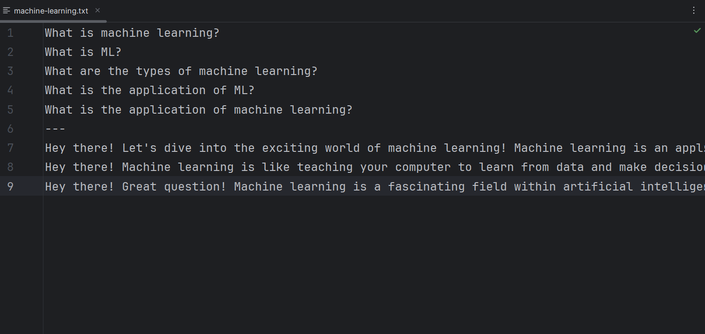
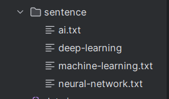
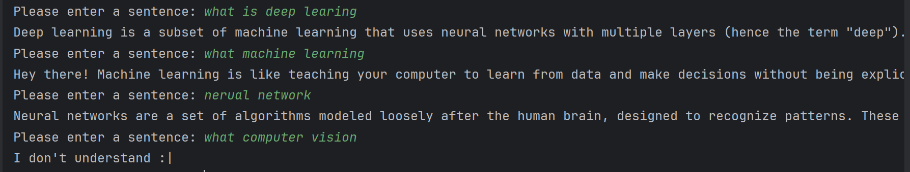

# Chatbot With Deep Learning

This project is able to answer the questions defined for it.

- Project
    - sentence
        - ai.txt
        - deep-learning.txt
        - machine-learning.txt
        - neural-network.txt
        - , ...
    - data.json
    - dataset.py
    - model.pth
    - test.py
    - train.py
    - utils.py

## Preparation steps:

1. Data preparation for model training:
    * To train the neural network for this project, it is necessary to specify the sentences and tags for the project. The neural network focuses on being able to identify the user's sentence with sentences and tags.
    * Collect the sentences that the user asks in different topics.
    * Categorize sentences that refer to a topic and consider a name (tag) for each category.
    * Try to include a number of sentences for each tag.
    * Consider several identical answers for each tag.
    * Note that the answers for each ***tag*** must have the same meaning.
    * Now, for all the tags you have, create files in txt format with your tag name and put the question sentences in it.
    * After the present sentences, you must put the answer sentences. Put three dashes (-) in the next line of questions and put the answer sentences below them. Like the sample files placed in the sentence folder.
    * The example below is the machine learning tag or questions and answers.
    
    * As in the example above, create all the tags with different files in the sentence folder.
    
    * Note that the tag is very important in choosing sentences and tagging each topic. The clearer and more complete the classification of user questions, the higher the accuracy of the model.

2. Neural network training:
    * To train the neural network, the train.py file must be executed.
    * After execution, the model.pth file is updated and trained with new sentences.
    * Note that every time the sentences and tags are changed, the model must be trained again, and after that there is no need to train again.

3. Run and test chatbot:
    * To run, just run the test file. The sentence is taken from the user and given to the model. If the model can find the desired tag with an accuracy of more than 75%, one of the response sentences of that tag will be randomly displayed to the user. If the accuracy does not reach 75%, the model will not answer.

Before using the project, you need to install the following libraries.

 ```bash
 pip install numpy pytorch nltk
 ```

# program outputs:



    